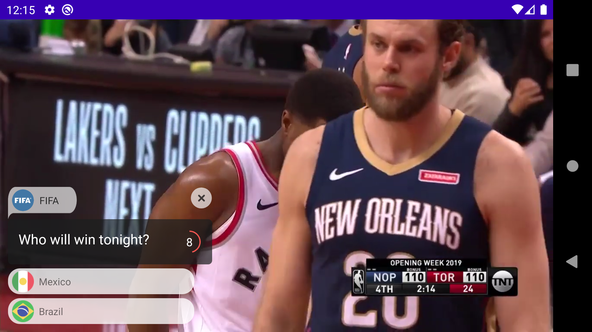

# Buff SDK

## How To:
While implementing the Buff SDK we tried to make sure integrating everything happened as simple as possible.
That's why you can integrate the Buff SDK in a few steps.

#### Step 1: The BuffView
Add BuffView into you layout.xml

    <com.buffup.views.BuffView
        android:id="@+id/buffView"
        android:layout_width="wrap_content"
        android:layout_height="wrap_content"

#### Step 2: Start\Stop.
In your Activity or Fragment, grab your BuffView and call `start()`.
Also, make sure you call `stop()` before leaving your activity to avoid any leaks.

    lateinit var buffView: BuffView

    override fun onStart() {
        super.onStart()
        buffView.start()
    }

    override fun onStop() {
        super.onStop()
        buffView.stop()
    }

#### Step 3: (Optional) Add Listener to receive useful events
Implement `BuffView.Listener` and pass it to your BuffView using `buffView.setListener()`.

    interface Listener {
        fun onErrorLoadingBuff(error: BuffError)
        fun onBuffEvent(event: BuffEvent)
    }

BuffEvents are:

    enum class BuffEvent {
        ON_TIMER_EXPIRED,
        ON_ANSWER_SELECTED,
        ON_USER_CLOSED_QUESTION,
        ON_QUESTION_LOADED
    }

Awesome, you're done! You can also check the sample app VideoApp for a quick demo.

# Sample App - VideoApp
The Sample App is a small application which shows the usage of the Buff SDK.
It plays a video and when the video starts it will start showing Buff question. When the app stops it will stop Buff.

The app takes advantage of the MVVM architecture to load a Video URL into a `LiveData` object which can be observed in the `VideoActivity`.
`VideoActivity` will have an instance of `VideoPlayerViewModel` which holds a reference to that `LiveData`, when the data is available it will automatically start playing the video.

## About the SDK.
The Buff SDK consists of a multiple custom views which are combined to create the main BuffView.
It consists of a "HeaderView" which holds the Author/Sender information. A "QuestionView" which holds the Buff Question and Timer. And, the list of answers.

The main BuffView will use its Presenter `BuffViewPresenter` to loa dBuffs from the backend API. But how that works?
`BuffViewPresenter` will combine our favorite HTTP client (That's `Retrofit`, of course) with Kotlin's Coroutines, which people like to call "Lightweight Threads", to make an API call to Buffs API (All this happening in background at light speed!).
When we receive the response, we'll parse it with the help of `Gson` and get an pretty object that is sent back to our presenter and redirected to the BuffView which is responsible to update the UI. In case anything bad happens along the way, we can catch possible errors and handle accordingly.

Also, we want to make sure our clients can help us improve and get the most out of Buff. That's why some of Buff events are sent back to the client app, I'm sure the analytics team will love it!

## 3rd Party Libraries

- Retrofit - https://square.github.io/retrofit/
Your favorite HTTP client for Android is also used with Buff SDK.

- Gson - https://github.com/google/gson
Google's JSON parser library.

- Glide - https://bumptech.github.io/glide/
See that circular images loading faster than lightning? That's Glide. That's why we use Glide.

- Timber - https://github.com/JakeWharton/timber
Have you ever had the impression that Android Log class is just a bit too limited? We do, that's where Timber comes to the rescue.

##### Thank you for checking this out and I hope you have enjoyed the reading :)
